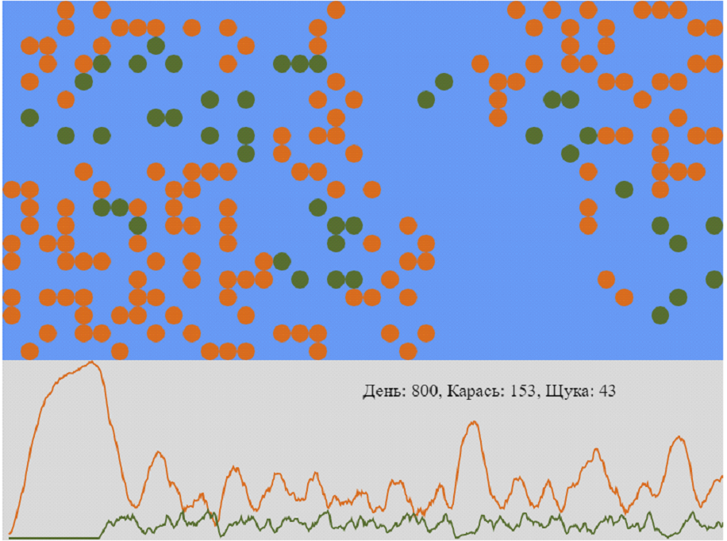

# Real-Time Predator-Prey Population Visualization

This project presents an interactive visualization of a predator-prey simulation, tracking populations of Crucian fish and Pike in real time. Using WebSocket data streams, the app dynamically renders spatial distributions and population counts on an HTML5 Canvas.

---

## Features

- **Real-time updates**: Live simulation data is streamed from the backend using Socket.IO.
- **Dynamic Canvas rendering**: Populations are displayed as colored circles positioned according to their coordinates.
- **Population Charting**: A time-series line chart visualizes population changes over simulation turns.
- **Responsive Scaling**: The visualization automatically scales based on simulation dimensions.
- **Image Export**: Users can download the current canvas view as a PNG image.

---

## Technologies Used

- JavaScript (ES6+)
- HTML5 Canvas API
- Socket.IO for WebSocket communication
- MVC pattern for clean code structure

---

## Usage

1. Open `index.html` in a modern browser.
2. The visualization connects to the backend server automatically.
3. Observe the real-time population distribution and charts.
4. Use the download link to save snapshots of the visualization.

---

## Code Structure

- `PredPreyView` — Responsible for drawing populations and charts on the canvas.
- `ChartView` — Manages rendering of population time series chart.
- `PredPreyCtrl` — Handles WebSocket communication and state updates.

---

## Screenshot

---

## Future Improvements

- Add controls for simulation parameters (e.g., reproduction rate, hunting efficiency).
- Implement additional species and more complex ecological interactions.
- Enhance UI with tooltips and detailed population statistics.

